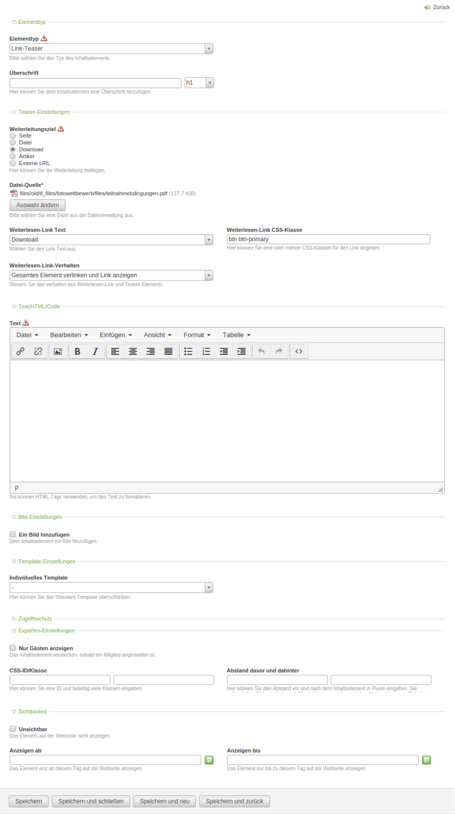

# Teaser

Teaser is a contao content element, that provides the ability to link the element with pages, articles, files, downloads and external urls.
Can be used as replacement for ce_page_teaser. 

## Features
 
* Custom text and css-class for more link
* Link the whole article
* Hide more link, link entire element.
* Overwrite content template

    
    
### Content elements

Name | Description
---- | -----------
HeimrichHannot\Teaser\ContentLinkTeaser | The content element, that provides the teaser settings.

### Fields

tl_content:

Name | Description
---- | -----------
source | Radio button, to select the source type. (page, article, link, download, external url)
jumpTo | The page id, from tl_page, where to jump to.
articleId | The article id, from tl_article, where to jump to.
fileSRC | The file source uuid, from tl_files (required by link and download sources).
teaserLinkText | A dropdown the link text can be selected from.
teaserLinkCssClass | A text field, to put in the css class for the link element.
teaserLinkBehaviour | A dropdown to select the link behaviour from.
teaserContentTemplate | Overwrite the teaser content template.
